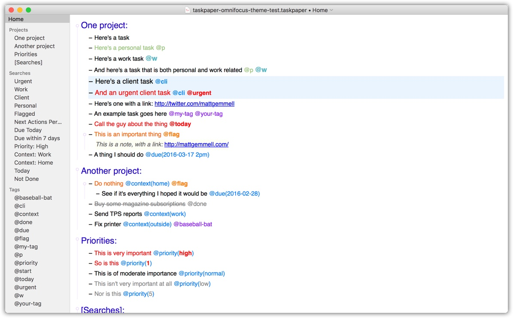

# _My_ TaskPaper 3 Theme

A custom TaskPaper 3 Theme, adapted to my use of TaskPaper as a task list, but without much focus on projects.

More of a "dumping ground" or "list of tasks"

## Acknowledgements

The starting point for this theme is Matt Gemmell's _excelent_ Omni-Focus based theme (<https://mattgemmell.com/taskpaper-3/>).

I've also borrowed elements (colors, syntax elements...) from @jasonshanks's excellent [Atom One Dark 2 for TaskPaper 3](https://github.com/jasonshanks/TaskPaper-Atom-One-Dark)

## ChangeLog

- 2018-03-31: Added `@cli` tag (highlighted based on background color) and cleaned up/updated Searches in the sample file

## Preview

The main changes from Matt's theme is adding a couple of tags (`@p` for Personal tasks and `@w` for Work related ones), and reducing the font size.
Also added `@cli` tag, highlighted based on background color.

I've copied Matt's sample file and changed it to add lines with the relevant tags etc, and applied the updated theme (my changed version is [here](./taskpaper-omnifocus-theme-test.taskpaper)) and the result is below:

## Installation

Move the Atom-One-Dark-Blue.less file to:

`~/Library/Application Support/TaskPaper/Stylesheets`

> NOTE: From within TaskPaper you can open this folder location from the **Window** menu > **StyleSheet** > **Open StyleSheet Folder**.

## Installation (prior to TaskPaper 3.5)

Backup then replace the **theme.less** file located at:

`~/Library/Application Support/TaskPaper/`

> NOTE: You can easily get to this folder location from the TaskPaper File menu > **Open Application Folder**. ALSO NOTE: You will need to change the name to theme.less to be recognised by TP versions earlier than 3.5

PD: This theme and associated files can be found in GH: <https://github.com/jjarava/TaskPaper-Theme-Customized>